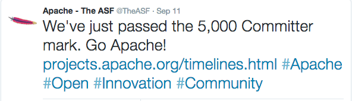

## <i class="fa fa-sign-in"></i> Pain Points of Contribution in the Drupal Community
####

http://bit.ly/pain-points-in-drupal-community
Note:
- Slides and speaker notes available online

## Take notes[http://bit.ly/pain-points-contribution](http://bit.ly/pain-points-contribution)

## Kgoel

<a href="https://www.drupal.org/u/kgoel"><i class="fa fa-drupal"></i> kgoel</a>

<a href="https://twitter.com/kalpanagoel"><i class="fa fa-twitter"></i> kalpanagoel</a>

<!-- .slide: data-background="custom/images/" data-background-size="" data-state="show-header" data-header="" -->

## Valery Lourie

<a href="https://www.drupal.org/u/valthebald"><i class="fa fa-drupal"></i> valthebald</a>

<a href="https://twitter.com/valthebald"><i class="fa fa-twitter"></i> valthebald</a>

Note:
- About presenter

## What is contribution
<!-- .element: class="heading" -->
<!-- .slide: data-background="custom/images/mentoring.jpg" data-background-size="" data-state="show-header" data-header="" -->

## graph placeholder

## IRC

## How do I use IRC?

## Difficult to keep up on IRC

## No scroll back

## Setting up bouncer costs money

## Exploring Alternatives
drupal.org/node/2490332
Evaluate whether to replace drupal IRC channels with another communication medium

## Need an easier way to communicate.
## subscribe to issue notifications in email
## https://groups.drupal.org/core/updates

## How do we recognize contribution?
www.drupal.org/node/2230579
[policy, no patch] Allow crediting reviewers (and other non-coders) as first-class contributors

## Doc review

## https://www.drupal.org/node/2281763
make profiles better [Meta] New design for User Profiles

## Credit to mentors?
Contributors can add mentors at the end of the sprint.

##

##

## Encourage companies to contribute their developer time?
 cost of using OSS is giving back to the community.

## Suggestions

## Get more reviewers

##  Need more documentation, video, audio, walking people through issues

## Drupal workflow is very unique and it doesn't apply to other OSS projects.

## Make sure that communications that happen in IRC are summarized and documented on issues

## Motivation?

## Time?

## Empathy

## What other OSS projects are doing?

## Is your employer looking to hire any core developer? http://www.drupalcoredevelopers.com/

## Slide title

Note:
- Image as fragment

## Slide title
<!-- .element: class="heading" -->

Note:
- Title with a box around it

## Slide title
<!-- .element: class="heading invert" -->

Note:
- Inverted

> <i class="fa fa-quote-left"></i>
> I mashed the button, but it didn't do anything.
> <i class="fa fa-quote-right"></i>

Note:
- Quote

> <!-- .element: class="invert" -->
> <i class="fa fa-quote-left"></i>
> Me too!
> <i class="fa fa-quote-right"></i>
> <i class="fa fa-heart fragment current-visible" style="color: #c00;"></i>

Note:
- Inverted quote with a fragment
