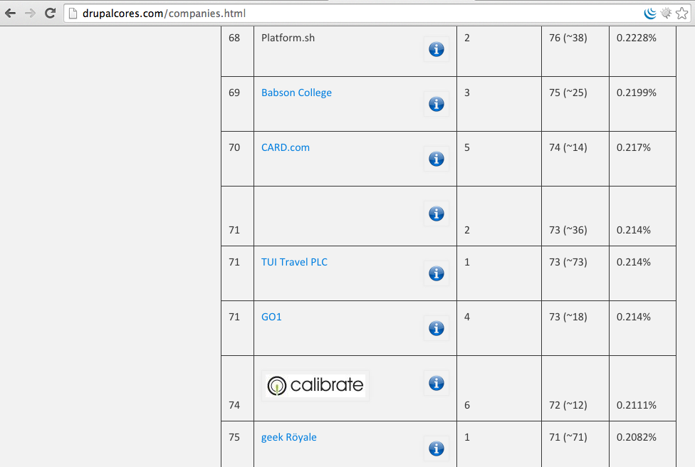

# Pain Points of Contribution in the Drupal Community
Note:
- KG
- Hello Everyone! We are going to talk about "Pain Points of Contribution in the
Drupal Community".

## Notes
[bit.ly/pain-points-notes](http://bit.ly/pain-points-notes)

## Slides
[bit.ly/pain-points-slides](http://bit.ly/pain-points-slides)

Note:
- KG
-bit.ly link for taking notes because more notes are better and after the
session, Val and I will be preparing synthesis.
We have posted slides with speaker notes online and bit.ly
link for our session is. You can follow along the slides.

## Kalpana Goel

<a href="https://www.drupal.org/u/kgoel"><i class="fa fa-drupal"></i> kgoel</a>

<a href="https://twitter.com/kalpanagoel"><i class="fa fa-twitter"></i> kalpanagoel</a>

Note:
- KG
I am from Washington D.C.
- Developer at Forum One
- Forum One is full service digital agency and does lot of work in Drupal for
Government and non-profit organizations.

<!-- .slide: data-background="custom/images/" data-background-size="" data-state="show-header" data-header="" -->
## Valery Lourie

<a href="https://www.drupal.org/u/valthebald"><i class="fa fa-drupal"></i> valthebald</a>

<a href="https://twitter.com/valthebald"><i class="fa fa-twitter"></i> valthebald</a>

Note:
- Val
- Drupal developer, devops
- Founder, Wise Trout Drupal agency
- I am hirable!

<!-- .element: class="heading" -->
<!-- .slide: data-background="custom/images/mentoring.jpg"  data-state="show-header" data-header="" -->
## Contribution
<!-- .element: class="heading" -->

Note:
- KG
- We are talking about pain points of contribution but lets talk first...
What is a contribution?
-  Contribution is organizing sprints,camps, meet ups, documentation, manual
testing, design review, UX but here we are going to talk mainly about code
contribution.

## IRC
Note:
- KG
- How many people in the audience use IRC? As you know that Drupal lives on IRC
and our day to day interaction occur in IRC related to issues in the issue queue
. For a new contributor, it is hard to know that there is an IRC unless someone
 tell them there are IRC channels that they can join and ask question/have
 discussion.

## How people learn about IRC?
[drupal.org/irc](https://drupal.org/irc)
Note:
- KG
- Concern for many of the user is - How do I connect to IRC, what channels
 should I be in?
 drupal.org/irc has list of IRC channels and this information is not available
 on drupal.org homepage.
- supposed way to IRC channel for a new person: search for 'start contributing',
go to core mentoring page - go to IRC page

## Difficult to keep up on IRC
Note:
-KG
- There is no indication of "this user is typing" so there are 3 people talking
together and for example I am asking with someone else. All this get very
confusing.

## No scroll back/history
Note:
- KG
- There is no scroll back or history in IRC so if there was an interesting
conversation and if we aren't there then we don't know about it not that we want
to know but sometimes we do.

## Setting up bouncer costs money
Note:
- KG
 - What is a bouncer? Bouncer is a piece of software running on remote servers.
 Advantage of bouncer - you are always connected on IRC.
 - Setting up bouncer costs money and it requires technical steps to set it up.
 Although it's easier later once you have set it up but initially it takes time
and money.

## Exploring Alternatives
[drupal.org/node/2490332](http://drupal.org/node/2490332)

Evaluate whether to replace drupal IRC channels with another communication
medium
Note:
- KG
- Need an easier way to communicate? In this issue community is exploring
options to use some other chat app instead of IRC.
Waartaa (OSS), Slack, Hipchat are some of the options being discussed in this
issue.

## subscribe to issue notifications in email

Note:
- Val
- We can subscribe to core issues and get email when there is a new comment made
on the issue or someone posted a new patch so that's one way to keep inform
about the changes.

## [groups.drupal.org/core/updates](http://groups.drupal.org/core/updates)
Note:
- Val
- alternative to IRC - core updates via email, also posted on drupal.org
already have Drupal core updates (a.k.a. "This Week in Drupal Core")
is a weekly-to-monthly update on all the cool happenings in Drupal 8!

## How do we recognize contribution
[drupal.org/node/2230579](http://drupal.org/node/2230579)

Allow crediting reviewers (and other non-coders) as first-class contributors
Note:
- Val
- In this issue, we are talking about categorizing comment as review
types
Research - how things are done in Drupal, why it is broken and how other
projects accomplish something.
Proposal - If someone propose a idea or a specific architectural change
Patch - provide a solution or patch
Reviewers - Provide valuable reviews to the issue

## Doc review
Note:
- KG
- How do we give credits to reviewers reviewing docs? Use my example - I was
reviewing doc issue for one of the safemarkup issue and I said I reviewed the
doc and talked to contributor(who wrote the patch) in-person about making some
 changes, changes were made, issue was marked RTBC (if you don't know what is
RTBC then it is Reviewed and tested by the community) and I didn't get
commit credit. Why? Because I didn't say...yes, this line in this patch applies
for this function or method and it does exactly what it is supposed to do so
even I read the entire method and looked at the doc but failed to write that in
the comment and I ended up getting no credit after spending 2 hour on that issue.
SO in short provide a thorough feedback and not just that this works for me or I
applied the patch and it worked fine. For any kind of review and not just the
doc review..write the the review thoroughly because who doesn't like commit
credit.

## [www.drupal.org/node/2281763](https://www.drupal.org/node/2281763)
make profiles better [Meta] New design for User Profiles
Note:
- KG
- How many people think that their user profile page on Drupal.org is important
and they have added it to their resume? There has been some improvements made to
user profile pages on Drupal.org for example - now it shows commit mention on
 number of issues that has been marked fixed during the last 3 month.  I think
 its a huge improvement because we do recognize the value of having a nicer
 user profile pages with valuable information on D.O

## Credit to mentors
Note:
- Val
- Contributors can add mentors at the end of the sprint so whoever is planning
on attending sprints on Friday, please add mentors to your profile page so they
can get credit and not just necessarily in-person mentoring but IRC mentoring as
 well. Mentoring isn't easy and mentors could work on the issues if
they want to but they spend time with participants and help them work on issues.

## User profile

## User profile

Note:
- KG
- This is screenshot of my profile page. As you can see I have listed some
people as my mentor and some people listed me as their mentor which is a way of
showing appreciation for me that I helped them on something.Also, my profile
 shows that I have got commit mention on 12 issues that has been marked fixed
 during the last 3 month. This is a new feature.

## Encourage companies to contribute their developer time
Note:
- KG
- What can we do to encourage companies to contribute their developer time to
core? Beside drupalcores.com/companies we don't really have any place to
recognize core contribution. There is an option to check company name if
contributor is working on issue and I think there is a plan in the pipeline
to display name of the companies somewhere on drupal.org.Companies like to
 sponsor DrupalCon, camps etc because they get
the exposure. How long it took us to raise D8 Accelerate fund? D8 Accelerate is
to help release Drupal 8 by funding core developers to work on critical issues.
There is a session on this - Paid contribution - Past, Present, and Future on
Thursday at 1 pm. We encourage you to come and participate.

## Companies

## Cost of using OSS is giving back to the community

Note:
- Val
What about contributors? All of us have responsibilities and have limited time
but we do want to work on core so time is a big factor for most of the
contributors. Also, money is another factor. Most of us have full-time jobs and
responsibilities. We would like to help writing patch, review etc so how can
we find time and money to support and contribute back to the community.
There is a BoF on increasing contribution in OSS on Thursday at 11:45 AM

##Other OSS projects

Note:
- Recently, Apache tweeted that they passed 5000 committer/contributor mark.

## Apache Timeline

Note:
- I think we can learn from other OSS projects as how they are doing things
differently in their OSS project but I don't think this is the problem for us
More contributors are better but goal should be to encourage repeated
contributors.

## Long tail graph

<small>photo credit: xjm</small>
Note:
- As I was talking in the previous slide...you can see long tail of graph. We
have lots of contributor with 1 to 5 commit mention but we need to encourage
them to become repeated contributors. This graph is little old because we do have
3150 core contributors.

## Suggestions
* More reviewers
* Documentation
* Workflow
* Communication
* Motivation
Note:
- Val
We talked about pain points and here are some of our suggestions to resolve some
of the pain points which were raised during DrupalCon LA discussion
Get more reviewers
Need more documentation, video, audio, walking people through issues
Drupal workflow is very unique and it doesn't apply to other OSS projects.
Make sure that communications that happen in IRC are summarized and documented
on issues
KG
Motivation - Find motivation to work on issues. We don't to have the experience
where there are 100's of comments and issue go nowhere. We need more reviewers
so the issue can move forward.
Time - Have some time available to work on core so all of us can have time to do
stuff outside Drupal and still enjoy working on core. I don't know if there is
any solution for this.

## Please come to the sprints on Friday

## Thank You!
## Don't forget to rate our session

[bit.ly/pain-points-in-drupal-community](http://bit.ly/pain-points-in-drupal-community)
